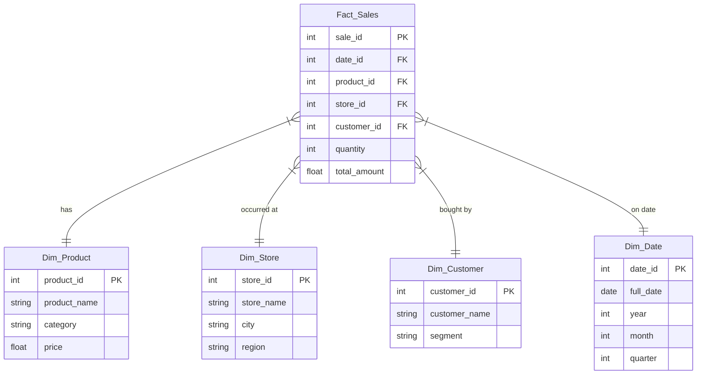

# Retail Business Intelligence System Using Data Warehousing Techniques

This project will build a comprehensive Business Intelligence dashboard powered by a simulated Data Warehouse using a Star Schema. 

## User Review Required

Please review the proposed tech stack and architecture. 
- **Tech Stack**: Python (for ETL), SQLite (for the Data Warehouse), Streamlit + Plotly (for the BI Dashboard).
- **Architecture**: A Star Schema containing `Fact_Sales` and dimensions `Dim_Product`, `Dim_Store`, `Dim_Customer`, `Dim_Date`.

## Phase 1: Requirement Analysis & Planning
- **Goal**: Track retail KPIs such as Revenue, Top Selling Products, Category Performance, and Sales Trends over time.
- **Scope**: Create mock data, build an ETL pipeline in Python, store data in an SQLite Data Warehouse, and visualize it in a clean Streamlit dashboard.

## Phase 2: Design & Architecture
- **Data flow**: CSVs -> ETL Script (Python) -> SQLite DB (retail_dw.db) -> Streamlit App -> Frontend Dashboard.
- **Schema**: Star Schema

## Phase 3: Implementation / Coding

### Data & ETL
- `data/`: Folder containing mock CSVs for sales, products, stores, and customers.
- `etl/etl_pipeline.py`: Python script using `pandas` and `sqlite3` to Extract from CSVs, Transform (cleanse data, map IDs), and Load into the SQLite data warehouse.

### Dashboard Application
- `dashboard/app.py`: A Streamlit web application.
- Use of Streamlit elements and Plotly for visually appealing, interactive charts.
- Direct execution of analytical queries on `retail_dw.db` (e.g., `SELECT category, SUM(total_amount) FROM Fact_Sales JOIN Dim_Product ... GROUP BY category`).

## Phase 4: Testing & Debugging
- Unit tests for data processing.
- Data validation checks to ensure data integrity during the ETL process.
- Graceful error handling on the dashboard.

## Phase 5: Report & Presentation
- Write a `Project_Report.md` outlining the methodology, instruction guide to run the system, design choices, and screenshots of the BI dashboard.
